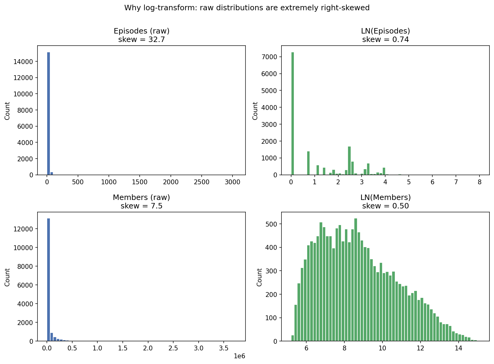
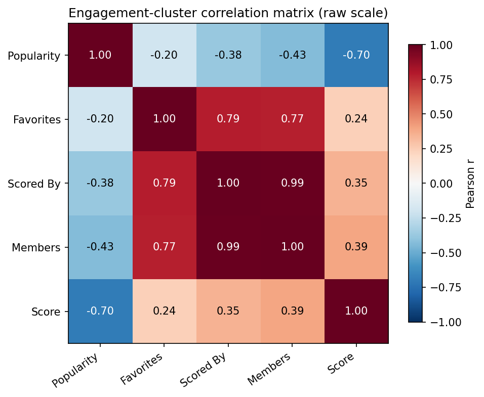
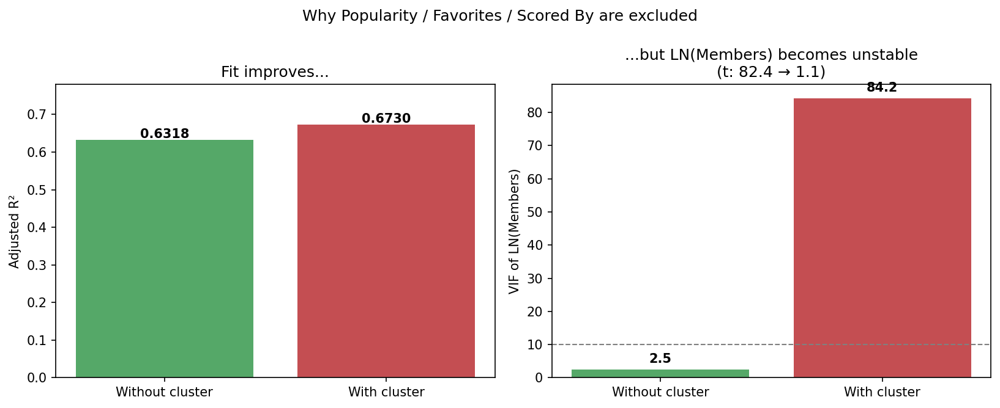
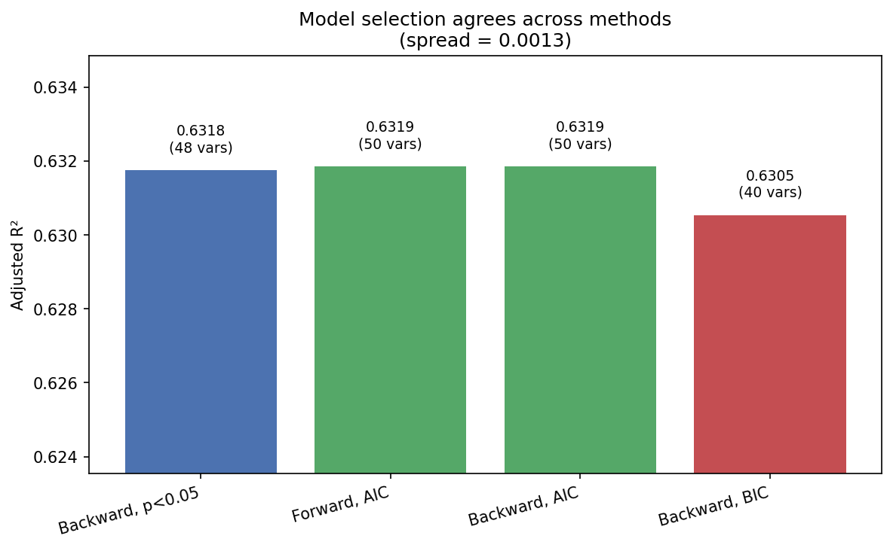
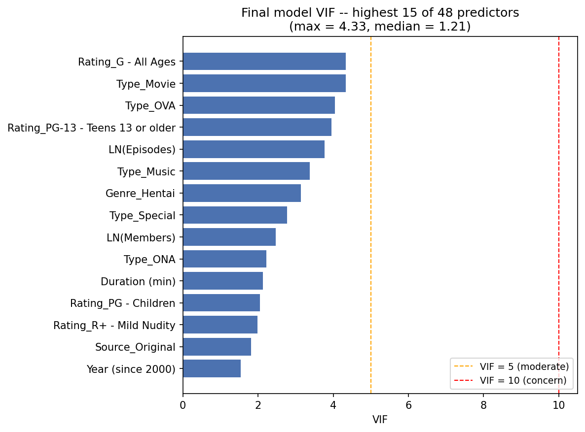

# MyAnimeList Analytics Project — Full Report

**Scope:** end-to-end analytics project on the MyAnimeList (MAL) dataset — ETL and dimensional modeling, descriptive BI dashboards, an inferential statistics test, and a predictive regression model.

**Data sources (4 raw CSVs, loaded via Power Query):**

| Source file | Contents |
|---|---|
| `anime-dataset-2023.csv` | One row per anime: title, genres, type, episodes, air dates, studios, source material, rating, popularity/engagement metrics |
| `user-filtered.csv` | One row per (user, anime, rating) — the rating fact table |
| `users-details-enhanced-2023.csv` | One row per user: demographics, join date, list statistics |
| `countries.csv` | Country reference table (ISO codes, region/subregion) for geographic analysis |

*Note: `users-details-enhanced-2023.csv` is not itself a raw export — it's the output of a separate Python cleaning/geocoding pass over the raw `users-details-2023.csv` (see Section 1.1a) that derives a `Country` column from the free-text `Location` field before this file ever reaches Power Query.*

**Tools used:** Power Query (M) for ETL, Power Pivot / DAX for the data model and measures, PivotTables/PivotCharts with VBA for dashboard interactivity, Excel's Analysis ToolPak for hypothesis testing, a separate workbook with `LINEST`/dynamic-array formulas for an initial regression prototype, and Python (pandas, statsmodels) for the deeper regression modeling that goes beyond what's practical in native Excel formulas.

---

## 1. Data Architecture: ETL & Data Model

### 1.1 ETL highlights (Power Query / M)

The raw CSVs needed real cleanup before they were usable. A few of the harder problems solved in the `Anime` query specifically:

- **Inconsistent air-date text** (`"Aired"` values like `"Apr 3, 2013 to Sep 28, 2013"`, `"2021"`, or `"Not available"`) was split into `Began Airing` / `Ended Airing`, then parsed with a custom function that branches on whether the value is year-only, month+year, a full date, or missing — rather than assuming one consistent format.
- **Free-text duration** (`"24 min per ep"`, `"1 hr 30 min"`) was parsed into a clean `Duration (min)` numeric column by detecting the presence of `"hr"` and `"min"` substrings and extracting the numbers around them.
- **Placeholder nulls** (`"UNKNOWN"`, `"Unknown"`, and `0` in Rank/Popularity, which MAL uses to mean "unranked" rather than an actual rank of zero) were explicitly replaced with true nulls so they wouldn't distort later aggregations.
- **Row-level junk filtering**: rows that were both missing a Type and had 0 Members and 0 Favorites (effectively placeholder/incomplete entries), and not-yet-aired titles with no engagement data yet, were removed.
- A **`Display Name`** column was constructed (truncated title + type + year) specifically to give PivotTable dropdowns and chart axis labels a readable, de-duplicated label instead of the raw title.

Because a single anime can have multiple genres and multiple studios, `Genres` and `Studios` (comma-separated text in the source) were each split into up to 9–10 columns and then **unpivoted** into two long-format bridge tables, `Anime_Genres` and `Anime_Studios` — this is what makes the many-to-many relationships in the data model possible.

On the `User` table: `Age` and `Years Active` are computed from `Birthday`/`Joined` against the current date, with implausible ages (under 5 or over 80 — clearly bad source data) nulled out rather than left in to skew averages. `Completion Rate`, `Rewatching Rate`, and the `Watcher Type` bucket (Casual <100 / Average 100–500 / Avid 500+ completed titles) are all derived here — `Watcher Type` in particular is the grouping variable used in the ANOVA analysis in Section 3. Users with zero days watched or zero total entries were filtered out as inactive/empty accounts.

A few tables (`Country_Lookup`, `Backlog_Paradox_Sample`) apply a random-sample filter (`RandomSample <= 0.02` or `0.005`) before loading — a deliberate performance trade-off to keep specific chart/table visuals responsive against a 250,000+ row User table without needing every single row.

### 1.1a Cleaning and geocoding user Location data (Python)

Before `users-details-2023.csv` was ready for Power Query, its free-text `Location` field needed a separate Python pipeline (`Country_Extraction.ipynb`) to turn a self-reported string field into a usable `Country` column — the enriched output of this notebook, `users-details-enhanced-2023.csv`, is the file the Power Query model actually loads, not the raw MAL export.

**Scale of the problem:** of 53,285 distinct raw Location strings, 51,935 (97%) occur 10 times or fewer, and 43,027 occur exactly once — with that little repetition, a manually-curated block-list of fake/troll entries isn't practical. An LLM was used to review the long tail and generate `fake_locations.json`, a curated list of clearly non-geographic strings (jokes, refusals, fictional places) to filter out, rather than attempting that by hand.

**Cleaning pipeline, in order:**
1. Filter against the LLM-identified fake-location list (raw form) — 7,162 rows removed.
2. Normalize remaining strings: Unicode-decompose accented characters (NFKD) and drop the combining marks, strip anything that isn't a letter or whitespace via regex, title-case the result — applied identically to the user `Location` column and to the reference city/state/country name columns, so downstream string matching compares like with like.
3. Filter against a second, post-cleaning fake-location list — 1,670 more rows removed.
4. Filter against a hand-built regex library of troll patterns (meme filler like "lol"/"idk", deflecting non-answers, fictional-universe names drawn from anime and pop culture, numeric/placeholder junk) — 686 more rows removed.

142,371 user rows survive this cleaning stage.

**Country matching:** a custom `determine_country()` function matches each cleaned Location string against a world-cities reference (`cities.csv`) at three levels — exact country name, state name, city name — with country abbreviations (USA, UK, UAE, etc.) checked first but only when word-isolated, to avoid false positives like matching "UK" inside "Ukraine." When a location string matches multiple candidate places, the function resolves the country by preferring whichever country recurs most often across the matches, then the longest matched string, then a hardcoded `country_priority` list (roughly ordered by real-world MAL user-base size) as a final tiebreaker. Lookup structures (country/state/city name sets and their row indices) are built once before the row-wise pass rather than rebuilt per row — a necessary optimization given the scale: applying the function across all 142,371 rows still took 32.2 minutes.

A handful of residual edge cases (a "Saudi Araba" typo, one manually-verified user record) were corrected by hand after the automated pass, and the enriched table — with the new `Country` column merged back onto the full user table — was exported as `users-details-enhanced-2023.csv`, which Section 1.2 onward and the Geospatial Trends Dashboard (Section 2.2) treat as the user dimension's source.

### 1.2 Data model (star schema)


`Anime` and `User` sit as the two dimension-like hubs, connected through `User_Anime_Rating` (the rating fact table) and, on the anime side, through two bridge tables (`Anime_Genres`, `Anime_Studios`) that resolve the many-to-many relationship between one anime and its multiple genres/studios. `countries` links to `User` on `Country` for the geographic dashboard, and `Top_Studios_By_Anime_Count` is a derived lookup table (studios with ≥10 anime produced) used to keep studio-level visuals to a meaningful subset.

### 1.3 Key DAX measures

The many-to-many bridge tables mean a naive `CALCULATE` won't correctly filter `Anime` when a Genre or Studio slicer is applied — filters don't automatically flow across a bridge table in both directions. Nearly every measure on the `Anime` table therefore wraps its aggregation in explicit bidirectional cross-filtering:

```
Average_Popularity:=CALCULATE(
    AVERAGE(Anime[Popularity]),
    CROSSFILTER(Anime_Genres[anime_id], Anime[anime_id], Both),
    CROSSFILTER('Anime Studios'[anime_id], Anime[anime_id], Both)
)
```

The same `CROSSFILTER(..., Both)` pattern repeats across `Works_Count`, `Average Community Score`, `Total Community Members Count`, `Total Community Favorites Count`, and the rating-side measures (`Average True Rating`, `Total Watch Count`, `Distinct Users`, `Distinct Anime Rated`) — this is the one piece of DAX logic that everything else in the dashboard depends on. A few other measures worth noting:

- `Favorites_to_Members_Ratio` — a ratio measure (`DIVIDE`, which safely handles a zero denominator) used in the Genre Passion-vs-Reach analysis.
- `Watching_Rating_Ratio` and `Unrated Count` — quantify how much of a user's watch history actually got scored, versus watched-but-unrated.
- `average user mean score` — filtered to `Mean Score > 0` specifically so users who haven't rated anything don't drag the average toward zero.

---

## 2. Descriptive Analytics Dashboards

### 2.1 Overview Dashboard


Top-line KPIs (295 anime, 283,941 users, 2.59M total watch entries, 7.46 average rating) sit above six linked visuals: top 20 anime by community members, genre popularity over time, anime volume vs. average quality by year, quality vs. popularity (essentially a scatter of Score against MAL's Popularity rank), a studio bubble chart (average community score vs. total members, sized by works count), and a genre "passion vs. reach" scatter (Favorites-to-Members ratio vs. total members). Genre, Studio, and Premier Year slicers cross-filter all six panels together.

### 2.2 Geospatial Trends Dashboard


Country-level view: top 10 anime by total watch count per country, a box-plot of rating distribution by country, and two choropleth maps (average rating by country by genre, and most-watched genre by country) — both driven by a Country slicer paired with a Genre slicer. The KPI cards surface that the United States leads on both community size and watching count, while Action is the globally most-watched genre.

### 2.3 User Trends Analysis Dashboard


Distributions of Total Entries and Days Watched (both heavily right-skewed — the same shape problem addressed with log transforms in the regression work in Section 4), a nested donut of entry status (Completed/On Hold/Dropped/Plan to Watch) broken out by Watcher Type, and a Completion Rate vs. Plan-to-Watch-Count scatter. The donut chart here is a useful visual companion to the ANOVA in Section 3 — it already hints that Avid watchers carry a very different completion/backlog profile than Casual ones, before any formal test is run on their *rating* behavior specifically.

### 2.4 Supporting analysis sheets

Beyond the three main dashboards, a set of focused analysis sheets back specific questions:

| Sheet | What it answers |
|---|---|
| Genre Average Rating by Country | Built with `XLOOKUP`/`UNIQUE`/`TRANSPOSE` plus a data-validation genre picker |
| Harshest vs. Generous Countries | Which countries rate above/below the global average |
| Top Anime by Country / by Members Count | Ranked lists by watch count and by community size |
| Most Famous Genre by Country | `INDEX`/`MATCH`/`MAX`/`COUNTIFS` to find each country's top genre |
| Passion vs. Reach by Genre | Favorites-to-Members ratio against total Members, by genre |
| Studio Comparison (bubble chart source) | Works count, average community score, and total members per studio |
| Users Entries Status by Watcher Type | Average Completed/On Hold/Dropped/Plan-to-Watch counts, normalized to % of type |
| Descriptive stats of anime status | Quartiles/min/max for Completed, On Hold, Dropped, Plan to Watch |

---

## 3. Statistical Analysis I — Does Watching Volume Affect Rating Behavior?

**Question:** does a user's watching volume (Watcher Type: Casual/Average/Avid) relate to how they rate anime on average (Mean Score)?

**Method:** the three Watcher Type groups were reshaped into separate columns with a dynamic `FILTER()` formula, then tested with a one-way ANOVA (Analysis ToolPak) followed by pairwise Welch's t-tests (unequal-variance, since the ANOVA showed meaningfully different group variances) with a Bonferroni-corrected significance threshold of 0.05/3 ≈ 0.0167 to account for running three comparisons off the same data.

**Group summary:**

| Watcher Type | Count | Average Mean Score | Variance |
|---|---|---|---|
| Casual (<100) | 231,009 | 8.343 | 1.243 |
| Average (100–500) | 97,609 | 7.751 | 0.799 |
| Avid (500+) | 19,589 | 7.359 | 0.989 |

**ANOVA:** F(2, 348204) = 16,354.5, p ≈ 0, η² ≈ 0.086 — Watcher Type explains about 8.6% of the variance in Mean Score, a small-to-medium effect.

**Pairwise Welch's t-tests** (all significant even after Bonferroni correction):

| Comparison | t | df | p |
|---|---|---|---|
| Casual vs. Average | 160.72 | 226,775 | ≈0 |
| Average vs. Avid | −51.21 | 26,317 | ≈0 |
| Casual vs. Avid | −125.33 | 29,052 | ≈0 |

**Conclusion:** the pattern is statistically solid and monotonic — average rating steps down at every stage, Casual (8.34) → Average (7.75) → Avid (7.36), not just at the extremes, and every pairwise comparison agrees even under a corrected threshold. **This is an association, not a demonstrated cause.** The design is cross-sectional (different people compared at one point in time, not the same users tracked as their list grows), so at least three alternative explanations remain open: naturally more critical viewers may simply be more likely to become completionists (reverse association), Avid users are likely older and longer-tenured — an unmeasured Age/tenure confound could explain part of the gap, and Casual watchers may drop shows they dislike before scoring them, inflating their average through selection rather than genuinely different taste.

**Suggested next step**, not yet executed: a multiple regression of Mean Score on Total Entries, Age, and Years Active together — if Total Entries remains significant after controlling for Age and tenure, that strengthens the case that watching volume itself matters rather than just reflecting who tends to watch a lot.

---

## 4. Statistical Analysis II — Predicting Anime Score (Multiple Regression)

This analysis addresses a related but separate question from Section 3: rather than *user* rating behavior, it models what predicts an individual *anime's* Score from its own structural and content attributes (genre, studio, format, source material, episode count, audience size). **Sample:** 15,692 titles with a recorded Score, out of 24,878 total. The work happened in two stages — an initial model built natively in Excel, then a deeper analysis in Python once the questions being asked outgrew what formulas alone could practically do.

### 4.1 From workbook to model: building the regression inputs in Excel

Rather than extend the main Power Query/DAX model from Section 1, the regression work was built in a **separate workbook** (`animesscoreprediction.xlsx`), kept decoupled from the dashboard data model. It's structured in four sheets:

- **`Sheet1`** — a raw export of the anime table.
- **`Data`** — the same rows, with every categorical field (Type, Source, Rating, Genre, Studio) expanded into 0/1 flag columns. Because Genre and Studio are multi-valued comma-separated text fields (the same fields that needed unpivoting into bridge tables for the dashboard model in Section 1), each flag column here was built with `IF()` logic combined with `RIGHT()`/`LEFT()` substring checks against the raw text field, rather than a simple lookup — the one-hot encoding equivalent of what `pd.get_dummies()` does in Python, done natively in formulas.
- **`ModelSetup`** — assembles the actual design matrix: `Episodes` and `Members` log-transformed, `Premier Year` recentered, missing values imputed with the column median, and every predictor column filtered down to only rows with a non-blank Score (15,692 of 24,878) — all through a single dynamic-array `LET()` formula rather than helper columns.
- **`Regression` / `Diagnostics`** — the model output and checks (Section 4.2).

### 4.2 Initial modeling in Excel — LINEST, VIF, and where the tooling hit its limits

The initial regression was fit directly in Excel with `LINEST()` — no add-ins, no VBA — wrapped in a `LET()` formula that also derives coefficients, standard errors, t-statistics, R², Adjusted R², and F automatically as the underlying data changes. Multicollinearity was checked the same way: a full pairwise correlation matrix built with `MAKEARRAY()`/`CORREL()`, inverted with `MINVERSE()`, with each variable's VIF read directly off the diagonal of that inverse — the textbook definition of VIF, implemented without a single external tool.

Run on the same 48-predictor set later confirmed independently in Python, the Excel model landed at **R² = 0.6324, Adjusted R² = 0.6313, F = 572.64, n = 15,692** — versus Python's 0.6318 on the equivalent set (Section 4.5), a difference in the fourth decimal place. The VIF check agreed even more closely: **max VIF 4.33, median 1.21**, identical to Python's Section 4.6 result to two decimal places, despite the two being computed by entirely different methods (correlation-matrix inversion in Excel vs. `statsmodels`' regression-based VIF in Python). That agreement is a genuine cross-check that the feature engineering and initial specification were correct before any further work was done on top of them.

Where Excel ran out of room was everything that came next. Backward elimination across 60 candidates means iteratively refitting and dropping the worst term — mechanically possible with `LINEST()` but impractical to do by hand or re-verify dozens of times; cross-validated regularization (Lasso) has no native Excel equivalent at all; and the residual diagnostics in Sections 4.7–4.10 below (Breusch-Pagan, heteroscedasticity-robust standard errors, systematic curvature testing across candidate transformations) all assume a scripting environment where "try 100 candidate values and refit" is a loop, not manual re-entry. That gap — not a flaw in the Excel work itself — is why the remainder of Section 4 moved to Python (`anime_score_regression.py` / the accompanying notebook), picking up from the same 60-predictor design matrix Excel had already validated.

### 4.3 Feature engineering: why Episodes and Members are log-transformed

Episodes and Members are extreme right-skewed count variables:

| Variable | Min | Median | Max | Skewness (raw) | Skewness (logged) |
|---|---|---|---|---|---|
| Episodes | 1 | 2 | 3,057 | 32.6 | 0.73 |
| Members | 180 | 4,918 | 3,744,541 | 7.55 | 0.50 |



A skewness of 32.6 means the distribution is dominated by a handful of extreme long-runners sitting next to a typical 1–2 episode show; Members spans six orders of magnitude. Two consequences for OLS: **leverage** (a few extreme raw values would otherwise dominate a squared-error fit — log-transforming drops skewness from 32.6→0.73 and 7.55→0.50), and **functional form** (a proportional effect — 12→24 episodes plausibly mattering more than 500→512 — is more plausible than a flat linear one; LN(X) turns the coefficient into a semi-elasticity, a natural read for a variable spanning several orders of magnitude). Duration (min) was tested the same way and *not* transformed — its skew (−2.11) doesn't clear the same bar, and a direct head-to-head fit comparison showed a log transform doesn't actually improve the model, so it's kept on its raw scale.

### 4.4 Why Popularity, Favorites, and Scored By are excluded

Four columns describe audience engagement: Popularity, Favorites, Scored By, and Members. Only Members is used as a predictor.

| | Popularity | Favorites | Scored By | Members | Score |
|---|---|---|---|---|---|
| Popularity | 1.00 | −0.20 | −0.38 | −0.43 | **−0.70** |
| Favorites | −0.20 | 1.00 | 0.79 | 0.77 | 0.24 |
| Scored By | −0.38 | 0.79 | 1.00 | **0.99** | 0.35 |
| Members | −0.43 | 0.77 | 0.99 | 1.00 | 0.39 |



Scored By and Members correlate at 0.99 — not two independent signals, effectively the same one measured twice. Adding all three anyway does raise adjusted R² (0.6318 → 0.6730), but at a cost:



LN(Members)'s VIF jumps from 2.5 to 84.2 and its t-statistic collapses from 82.4 to 1.1 — the predictor doesn't stop mattering, its unique contribution becomes statistically inseparable from three near-duplicate columns. There's also a conceptual reverse-causality risk: Popularity is a MAL-computed rank that is itself entangled with Score, so including it risks predicting Score partly with a consequence of Score.

### 4.5 Model selection: from 60 candidates to a final set

Starting from 60 engineered predictors (R² = 0.6332, Adjusted R² = 0.6318), **iterative backward elimination** (drop the single least-significant predictor, refit, repeat until everything remaining clears p < 0.05) converges to a **48-predictor model**. This was cross-checked against stepwise selection on two information criteria — AIC (both forward and backward search, which independently converge to the *same* 50-predictor model) and BIC (harsher per-parameter penalty, converging to a leaner 40-predictor model):



| Method | # Predictors | Adjusted R² |
|---|---|---|
| Backward elimination, p < 0.05 | 48 | 0.6318 |
| Forward selection, AIC | 50 | 0.6319 |
| Backward elimination, AIC | 50 | 0.6319 |
| Backward elimination, BIC | 40 | 0.6305 |
| LassoCV (5-fold), regularization-based | 53 | ≈0.632 |

All five land within roughly 0.0014 of each other — the model's explanatory power isn't sensitive to the exact selection method, only a handful of borderline genre/rating/studio dummies move. Lasso in particular is a useful independent check: instead of adding/dropping variables one at a time by a threshold, it shrinks all 60 coefficients simultaneously via a cross-validated penalty, and it lands in the same place as the other four despite working completely differently. The 48-predictor backward-elimination model is used as the base for everything that follows.

### 4.6 Multicollinearity check



Maximum VIF across all 48 predictors is 4.33, median 1.21 — well clear of the usual 5–10 concern threshold, so every coefficient can be read individually. (This matches the Excel-based VIF from Section 4.2 to two decimal places, computed by an entirely different method.)

### 4.7 Residual diagnostics surface two problems

Checking the 48-predictor model's residuals turned up two separate issues, worth distinguishing clearly:

- **Nonlinearity**: Duration and LN(Episodes) both show real curvature against the residuals — confirmed formally by adding a centered squared term for each and testing the AIC improvement (Duration: −229 points; LN(Episodes): −60 points), both far beyond what noise would produce. LN(Members)² and Year² were also tested and found technically significant but negligible (−16 and −10 AIC) — not worth the added complexity.
- **Heteroscedasticity**: a Breusch-Pagan test on the 48-predictor model returns stat = 478.16, p ≈ 3.2×10⁻⁷² — residual variance is not constant across observations, meaning the model's standard errors (and therefore its p-values) can't be taken at face value as-is.

These are two different assumptions failing for two different reasons, and they're handled separately below.

### 4.8 Round 2 — folding the curvature back into the model

Duration and LN(Episodes) earned centered squared terms (centered specifically to avoid the squared term being artificially collinear with its own linear term), and selection was rerun from scratch with both added as new candidates, since their presence can change which other predictors survive. Both squared terms were retained, and `Genre_Romance` came in as a side effect (not significant in the original model, but significant once the curvature elsewhere was accounted for):

| | Predictors | Adjusted R² | AIC |
|---|---|---|---|
| Round 1 (Section 4.5, linear only) | 48 | 0.6318 | — |
| Round 2 (+ Duration², LN(Episodes)²) | 51 | 0.6386 | 26,289.5 |

Max VIF on the Round 2 model is 6.03 (Duration itself) — centering the squared terms did its job; no collinearity blowup from adding them. **Round 2 is used as the final reported model.** Duration's coefficient shifts from 0.0066 (Round 1) to 0.0117 (Round 2) — not directly comparable across rounds, since it's now the linear component of a curved relationship evaluated at the mean rather than a standalone flat slope.

### 4.9 Heteroscedasticity: what's driving it, and robustness under HC3

Re-running Breusch-Pagan on the Round 2 model shows the statistic *rising*, not falling (478.16 → 570.52, p ≈ 6.6×10⁻⁸⁹). That's not a contradiction: Breusch-Pagan tests whether residual *variance* depends on the predictors, a different question from whether the *mean* relationship is correctly shaped — fixing curvature doesn't guarantee it fixes variance too, and adding predictors can only raise the test's sensitivity, never lower it.

Regressing squared residuals directly on each predictor (the same mechanic Breusch-Pagan uses internally) shows the signal is **diffuse rather than caused by any single fixable term** — `Type_Special`, `LN(Episodes)`, `Genre_Horror`, `Rating_G - All Ages`, and `Duration (min)` (in both linear and squared form) top the list, alongside several Type/Genre/Studio category dummies. This looks like ordinary subgroup variance — rarer categories (Specials, Horror, G-rated titles) have noisier scores because they're more heterogeneous, not because any one continuous variable's functional form is wrong.

Since this variance pattern is structural rather than a missing-term problem, **HC3 heteroscedasticity-robust standard errors** are applied to the final model rather than chasing further re-specification. Two checks confirm this is sufficient:

- **0 of 52 predictors flip significance status** (α = 0.05) between naive OLS standard errors and HC3 — the uneven variance is real but wasn't distorting which variables would be called significant.
- **HC3 vs. the lighter HC1 correction differ by at most ~2.3%**, mostly under 1% — the specific robust-SE method chosen doesn't materially change the result.

### 4.10 Checking Premiered Year for the same issue — and why it was left alone

The same curvature check was run on Premiered Year, motivated by a practical concern: the model may eventually be used to score newly-premiering titles whose year lies outside the training data (1917–2023). A LOWESS-smoothed plot of Score against Premiered Year shows real wave-shaped curvature in the well-populated recent decades, and adding centered Year² and Year³ terms confirms it formally — both highly significant (p ≈ 5×10⁻²⁰ and 2.5×10⁻¹⁵) with a meaningful AIC improvement (26,289.5 → 26,205.2).

**This was tested but deliberately not adopted into the final model**, for two reasons specific to Year and not shared by Duration/Episodes:

1. **Severe multicollinearity between the Year terms themselves** — VIF of 23.0 (Year²) and 18.8 (Year³), versus 3.6 for linear Year. Centering removes this problem for a roughly symmetric variable (as it did for Duration/Episodes), but Premiered Year is heavily skewed — a long thin tail back to 1917, then a dense recent cluster — so the squared and cubed terms stay entangled with each other even after centering.
2. **Polynomial extrapolation risk.** A cubic curve fit to historical data has no constraint forcing it to keep behaving sensibly past the edge of that data — it can diverge sharply for any year past 2023. Since the point of checking this was specifically to protect predictions for *newer* titles, adding a term that makes exactly those predictions less stable would be counterproductive. Premiered Year stays as a single linear term.

### 4.11 Final model — top drivers of Score

The table below is from the Round 1 fit; the ranking and signs are essentially unchanged in the Round 2 final model, with three exceptions: Duration and LN(Episodes) are now curved rather than flat (Section 4.8) and `Genre_Romance` is newly retained.

| Variable | Coefficient | Direction |
|---|---|---|
| LN(Members) | +0.281 | Larger audience → higher score |
| Type_Music | +0.884 | Music-format entries score notably higher |
| Genre_Avant Garde | −0.422 | Strongest negative genre effect |
| Genre_Horror | −0.358 | |
| Type_Special | +0.482 | |
| LN(Episodes) | +0.184 (linear component; see 4.8) | Longer runtime associates with higher score |
| Source_Music | −0.470 | |
| Genre_Ecchi | −0.286 | |

All significant at p < 0.0001 (HC3-robust). These are associations from observational data, not causal claims — Type and Source likely proxy for production budget and audience self-selection effects not directly measured. Full coefficient table: `final_model_coefficients.csv`. Reproducible end to end via the accompanying notebook / `anime_score_regression.py`, building on the Excel-validated feature set from Sections 4.1–4.2.

### 4.12 Limitations

- **Associational, not causal.** All findings above come from observational data; Type, Source, and Studio effects likely proxy for unmeasured production budget and audience self-selection rather than a direct causal mechanism.
- **Heteroscedasticity is present and diffuse, not eliminated.** Both the Round 1 and Round 2 models fail the Breusch-Pagan test decisively. The cause is spread across multiple Type/Genre/Rating subgroups rather than one fixable term, so it's addressed with HC3-robust standard errors rather than further re-specification. The significance-flip check (Section 4.9) confirms this doesn't change which predictors are meaningful, but the raw variance imbalance itself remains.
- **Nonlinearity was real for Duration and Episodes, and is now handled — but Duration and LN(Episodes)'s Round 2 coefficients can no longer be read as a flat "per unit" effect** the way Round 1's could; they're the linear component of a curve evaluated at the mean.
- **Premiered Year also shows real historical curvature that was deliberately left unmodeled** (Section 4.10), trading a small, confirmed fit improvement (Adjusted R² +0.002) for more predictable behavior when scoring titles from years outside the training range. Predictions for premiere years well beyond 2023 should be treated with somewhat lower confidence than predictions within the training range, since even the linear term is an extrapolation there.
- **Possible non-independence between titles from the same studio was identified but not corrected.** Several studio dummies (Madhouse, Sunrise) appear among the top drivers of residual variance in Section 4.9's diagnostic, which could mean titles sharing a studio also share unmeasured factors that make their errors correlated rather than independent — a violation HC3 does not address (it corrects for uneven variance, not within-group correlation). A cluster-robust standard error check by studio was scoped but not run against the final model; it's a natural next validation step before treating any single coefficient's precision as final.
- **The Excel prototype validated the feature engineering and the Round 1 specification, but the deeper analysis (Sections 4.5, 4.7–4.10) — cross-validated selection, systematic curvature testing, and heteroscedasticity-robust inference — was only practical in Python.** The two tools agreeing closely on R², Adjusted R², and VIF (Sections 4.2, 4.6) is a real cross-check, but it only covers the parts of the analysis Excel was able to attempt.
- **Sample is restricted to titles with a recorded Score** (15,692 of 24,878). The model describes what predicts Score among titles established enough to have received one, not a random sample of every anime ever produced.

---

## 5. How the pieces fit together

The three analytical layers answer different-but-connected questions about the same dataset. The dashboards (Section 2) establish *what's happening*: which anime and genres dominate by engagement, how ratings vary geographically, and how the user base's watching habits are distributed. The ANOVA (Section 3) tests one specific behavioral hypothesis surfaced by that descriptive layer — that heavier watchers rate more critically — and confirms it holds up statistically, while being explicit about what it can't prove (causation vs. confounding vs. selection). The regression (Section 4) takes the complementary angle: instead of *who* rates harshly, it models what predicts *how an anime itself is scored* from its structural attributes, deliberately excluding engagement metrics like Members' near-duplicates for the same collinearity reasons the descriptive dashboards' `CROSSFILTER` logic exists to handle correctly in the first place — redundant or improperly-filtered signals distort conclusions whether they show up in a DAX measure or a regression coefficient.

One concrete cross-check: Members is both a top KPI in the Overview Dashboard and the strongest engagement-side predictor in the regression (t = 82.4) — the two analyses agree on its importance from completely independent methods (a DAX aggregation vs. an OLS coefficient), which is a reasonable internal-consistency check on the project as a whole.

---

## 6. Tools & Reproducibility

| Layer | Tool(s) |
|---|---|
| ETL | Power Query (M) |
| Data model & measures | Power Pivot, DAX (`CROSSFILTER` for many-to-many genre/studio relationships) |
| Dashboards | PivotTables, PivotCharts, VBA (custom chart hover interactivity) |
| Hypothesis testing | Excel Analysis ToolPak (ANOVA: Single Factor, t-Test: Two-Sample Assuming Unequal Variances), manual Bonferroni correction |
| Predictive modeling — prototype | Excel (`animesscoreprediction.xlsx`): `IF`/`RIGHT`/`LEFT` for one-hot encoding, `LINEST` for the regression, `MINVERSE`/`CORREL` for VIF |
| Predictive modeling — final | Python (pandas, statsmodels, scikit-learn) — accompanying notebook / `anime_score_regression.py` |

Every number in Section 4.3 onward traces to the accompanying notebook / `anime_score_regression.py`, runnable end to end (`pip install pandas numpy statsmodels scikit-learn openpyxl`) against the source data. Sections 4.1–4.2 reflect the standalone `animesscoreprediction.xlsx` workbook, which independently validated the feature set and Round 1 specification before the analysis moved to Python. Sections 1–3 reflect the existing Power Query, DAX, and Analysis ToolPak work already built into the main dashboard workbook.
